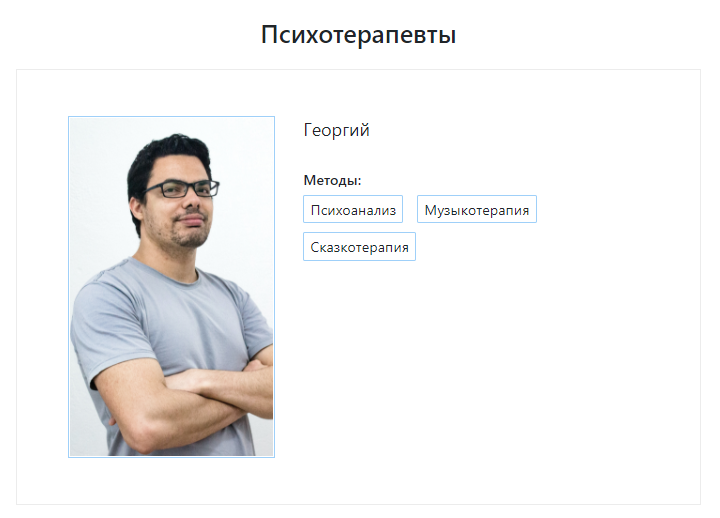

# Приложение с данными психотерапевтов

Страница с карточками психотерапевтов.  
Стек: Django + Vue + Bootstrap + PostgreSQL.


  
Данные на странице (и в базе) можно обновлять с помощью скрипта `therapists.py`.  
Пример запуска скрипта (Windows):
```
py .\therapists.py --key keyyQ4y9FQVXyzLz3 --base appazv5uiri4NCfCn --table Psychotherapists
```
`--key` — API-токен для доступа к таблице Airtable (можно получить в [профиле Airtable](https://airtable.com/account))  
`--base` — ID рабочего окружение Airtable (можно посмотреть в [документации к API](https://airtable.com/api) конкретного окружения)  
`--table` — название таблицы, из которой сохраняем данные  
  
Предполагается, что таблица Airtable будет иметь колонки со следующими названиями ([пример таблицы](https://airtable.com/tbl3Le5kAVZOUKtZr/viw0SdXxT1MNPlOXl?blocks=hide)):
* Имя
* Фотография
* Методы — список методов, с которыми работает терапевт
* Изменено — дата и время последней модификации записи  

  
При запуске скрипта происходит следующее:
1. Загружаются все данные из Airtable-таблицы.
2. Из БД удаляются те строки, которых больше нет в Airtable.
3. В БД обновляются или создаются новые строки.
4. В отдельную таблицу (её можно посмотреть через Django-админку) сохраняются сырые данные, выгруженные из Airtable.

### Как развернуть 

✔️ Предварительно установите [PostgreSQL](https://www.postgresql.org/).

#### Windows
1. Склонируйте репозиторий и создайте внутри папки виртуальное окружение:
```
git clone https://github.com/charlieplanka/psychotherapist-table.git
cd psychotherapist-table
virtualenv venv
```

2. Активируйте окружение и установите зависимости:
```
.\venv\Scripts\activate
pip install -r requirements.txt
```

3. Зайдите в консоль **postgreSQL** :
```
psql -U postgres
```
(`postgres` — имя пользователя-администратора по умолчанию)

4. Cоздайте юзера `meta` с паролём `meta`:
```
CREATE USER meta WITH PASSWORD 'meta';
```

5. Cоздайте базу `psycho` и назначьте юзера владельцем:
```
CREATE DATABASE psycho OWNER meta;
```

6. Выйдите из консоли postgreSQL:
```
\q
```

7. Запустите миграции:
```
python manage.py migrate
```

8. Запустите скрипт (можно использовать параметры по умолчанию — тогда данные будут выгружаться из [тестовой таблицы](https://airtable.com/tbl3Le5kAVZOUKtZr/viw0SdXxT1MNPlOXl?blocks=hide)):
```
py .\therapists.py --key keyyQ4y9FQVXyzLz3 --base appazv5uiri4NCfCn --table Psychotherapists
```

9. Запустите сервер (по умолчанию поднимется на 8000 порту):
```
python manage.py runserver
```

#### Linux
1. Склонируйте репозиторий и создайте внутри папки виртуальное окружение:
```
git clone https://github.com/charlieplanka/psychotherapist-table.git
cd psychotherapist-table
python3 -m venv venv
```

2. Активируйте окружение и установите зависимости:
```
source venv/bin/activate
pip install -r requirements.txt
```

3. Зайдите в консоль **postgreSQL** :
```
psql -U postgres
```
(`postgres` — имя пользователя-администратора по умолчанию)

4. Cоздайте юзера `meta` с паролём `meta`:
```
CREATE USER meta WITH PASSWORD 'meta';
```

5. Cоздайте базу `psycho` и назначьте юзера владельцем:
```
CREATE DATABASE psycho OWNER meta;
```

6. Выйдите из консоли postgreSQL:
```
\q
```

7. Запустите миграции:
```
python manage.py migrate
```

8. Запустите скрипт (можно использовать параметры по умолчанию — тогда данные будут выгружаться из [тестовой таблицы](https://airtable.com/tbl3Le5kAVZOUKtZr/viw0SdXxT1MNPlOXl?blocks=hide)):
```
py .\therapists.py --key keyyQ4y9FQVXyzLz3 --base appazv5uiri4NCfCn --table Psychotherapists
```

9. Запустите сервер (по умолчанию поднимется на 8000 порту):
```
python manage.py runserver
```
